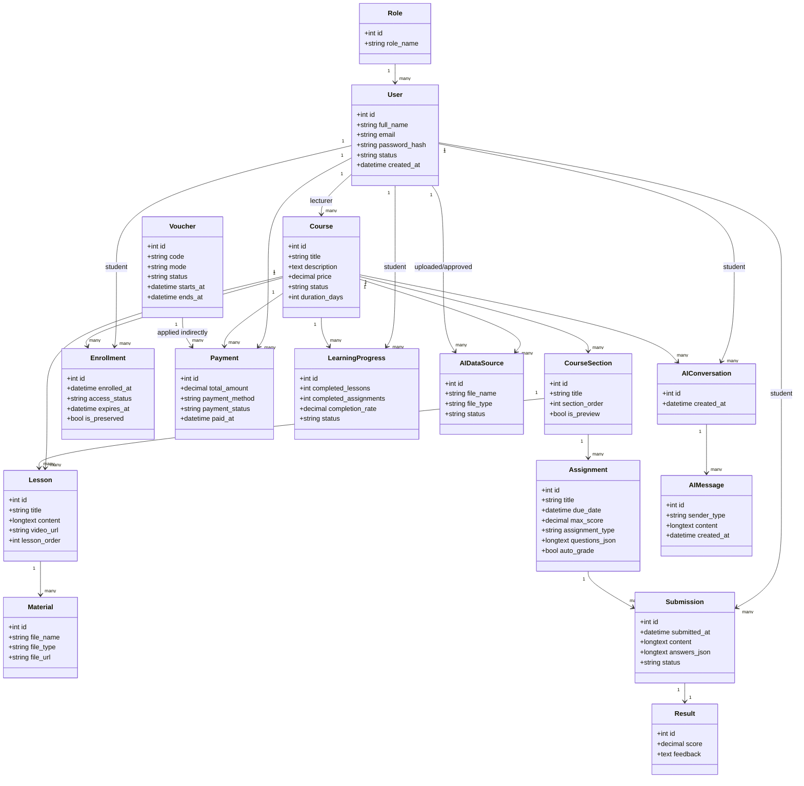
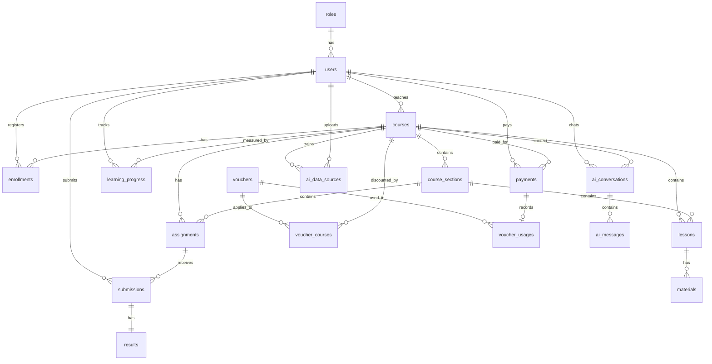

# 1.5. Xay dung bieu do lop

He thong E-Learning AI duoc thiet ke theo huong phan tach chuc nang thanh cac nhom nghiep vu chinh: quan ly nguoi dung, quan ly khoa hoc, dang ky - thanh toan, bai hoc - hoc lieu, bai tap - ket qua, theo doi tien do va ho tro AI. Do he thong duoc cai dat bang ReactJS va NodeJS/Express theo mo hinh Controller - Service - Repository, bieu do lop trong bao cao duoc mo hinh hoa o muc lop nghiep vu va lop thuc the du lieu.

## 1.5.1. Cac lop nghiep vu chinh

| Lop | Vai tro |
|---|---|
| `User` | Luu thong tin tai khoan nguoi dung, gom Admin, Giang vien va Hoc vien. |
| `Role` | Dinh nghia vai tro va quyen truy cap cua nguoi dung. |
| `Course` | Dai dien cho khoa hoc trong he thong. |
| `CourseSection` | Dai dien cho chuong/phan hoc cua khoa hoc. |
| `Lesson` | Dai dien cho bai hoc trong mot chuong. |
| `Material` | Luu tep hoc lieu dinh kem cua bai hoc. |
| `Enrollment` | Luu quan he dang ky khoa hoc cua hoc vien. |
| `Payment` | Luu giao dich thanh toan khi hoc vien mua khoa hoc. |
| `Voucher` | Luu chuong trinh giam gia/ma khuyen mai. |
| `Assignment` | Luu bai tap, bai kiem tra, quiz va cau hoi tu cham. |
| `Submission` | Luu bai nop cua hoc vien. |
| `Result` | Luu diem va nhan xet sau khi cham bai. |
| `LearningProgress` | Luu tien do hoc tap theo tung hoc vien va khoa hoc. |
| `AIDataSource` | Luu nguon du lieu AI do giang vien tai len va admin phe duyet. |
| `AIConversation` | Luu phien hoi dap AI cua hoc vien theo khoa hoc. |
| `AIMessage` | Luu tung tin nhan trong mot phien hoi dap AI. |

## 1.5.2. Bieu do lop tong quat



# 1.6. Thiet ke co so du lieu

Co so du lieu cua he thong duoc thiet ke tren MySQL, su dung engine InnoDB de ho tro khoa ngoai, rang buoc toan ven du lieu va quan he mot-nhieu giua cac bang. Cac bang trong he thong tuy nhieu nhung co the chia thanh cac nhom ro rang nhu sau:

| Nhom bang | Cac bang | Muc dich |
|---|---|---|
| Nguoi dung va phan quyen | `roles`, `users` | Quan ly tai khoan, vai tro Admin/Giang vien/Hoc vien. |
| Khoa hoc va noi dung | `courses`, `course_sections`, `lessons`, `materials` | Quan ly khoa hoc, chuong, bai hoc, hoc lieu. |
| Dang ky va thanh toan | `enrollments`, `payments` | Luu dang ky khoa hoc va giao dich thanh toan. |
| Voucher | `vouchers`, `voucher_courses`, `voucher_usages` | Quan ly ma giam gia va lich su ap dung voucher. |
| Bai tap va ket qua | `assignments`, `submissions`, `results` | Tao bai tap/quiz, nop bai, cham diem. |
| Tien do va AI | `learning_progress`, `ai_data_sources`, `ai_conversations`, `ai_messages` | Theo doi tien do hoc tap va luu du lieu hoi dap AI. |

## 1.6.1. Mo hinh co so du lieu



Ghi chu thiet ke: khi dua vao bao cao hoac ve tren draw.io, co the tach thanh 2 so do:

- So do chinh: `roles`, `users`, `courses`, `course_sections`, `lessons`, `materials`, `enrollments`, `payments`, `assignments`, `submissions`, `results`, `learning_progress`.
- So do mo rong: `vouchers`, `voucher_courses`, `voucher_usages`, `ai_data_sources`, `ai_conversations`, `ai_messages`.

Cach tach nay giup so do khong bi roi, nhung van phan anh day du database hien tai.

## 1.6.2. Chi tiet cac bang trong so do thuc the lien ket

### Nhom nguoi dung va phan quyen

| Bang | Khoa chinh | Khoa ngoai | Mo ta |
|---|---|---|---|
| `roles` | `id` | - | Luu danh sach vai tro: admin, lecturer, student. |
| `users` | `id` | `role_id` -> `roles.id` | Luu thong tin tai khoan nguoi dung. Email la duy nhat. |

**Bang `roles`**

| Truong | Kieu du lieu | Mo ta |
|---|---|---|
| `id` | INT | Ma vai tro. |
| `role_name` | VARCHAR(50) | Ten vai tro, duy nhat. |

**Bang `users`**

| Truong | Kieu du lieu | Mo ta |
|---|---|---|
| `id` | INT | Ma nguoi dung. |
| `full_name` | VARCHAR(100) | Ho ten nguoi dung. |
| `email` | VARCHAR(100) | Email dang nhap, duy nhat. |
| `password_hash` | VARCHAR(255) | Mat khau da ma hoa. |
| `role_id` | INT | Vai tro cua nguoi dung. |
| `status` | VARCHAR(20) | Trang thai tai khoan. |
| `created_at` | DATETIME | Thoi diem tao tai khoan. |

### Nhom khoa hoc va hoc lieu

| Bang | Khoa chinh | Khoa ngoai | Mo ta |
|---|---|---|---|
| `courses` | `id` | `lecturer_id` -> `users.id` | Luu thong tin khoa hoc. |
| `course_sections` | `id` | `course_id` -> `courses.id` | Luu chuong/phan hoc trong khoa hoc. |
| `lessons` | `id` | `course_id`, `section_id` | Luu bai hoc cua khoa hoc. |
| `materials` | `id` | `lesson_id` -> `lessons.id` | Luu tai lieu hoc tap dinh kem. |

**Bang `courses`**

| Truong | Kieu du lieu | Mo ta |
|---|---|---|
| `id` | INT | Ma khoa hoc. |
| `title` | VARCHAR(200) | Ten khoa hoc. |
| `description` | TEXT | Mo ta chi tiet. |
| `thumbnail_url` | VARCHAR(500) | Anh dai dien khoa hoc. |
| `intro_video_url` | VARCHAR(500) | Video gioi thieu. |
| `short_description` | VARCHAR(300) | Mo ta ngan. |
| `price` | DECIMAL(12,2) | Gia khoa hoc. |
| `lecturer_id` | INT | Giang vien phu trach. |
| `status` | VARCHAR(20) | Trang thai khoa hoc. |
| `duration_days` | INT | Thoi han hoc, NULL la khong gioi han. |
| `created_at` | DATETIME | Thoi diem tao khoa hoc. |

**Bang `course_sections`**

| Truong | Kieu du lieu | Mo ta |
|---|---|---|
| `id` | INT | Ma chuong. |
| `course_id` | INT | Khoa hoc chua chuong. |
| `title` | VARCHAR(200) | Ten chuong. |
| `description` | TEXT | Mo ta chuong. |
| `section_order` | INT | Thu tu chuong. |
| `is_preview` | TINYINT(1) | Cho phep hoc thu hay khong. |

**Bang `lessons`**

| Truong | Kieu du lieu | Mo ta |
|---|---|---|
| `id` | INT | Ma bai hoc. |
| `course_id` | INT | Khoa hoc chua bai hoc. |
| `section_id` | INT | Chuong chua bai hoc. |
| `title` | VARCHAR(200) | Ten bai hoc. |
| `content` | LONGTEXT | Noi dung bai hoc. |
| `video_url` | VARCHAR(500) | Duong dan video bai hoc. |
| `duration_seconds` | INT | Thoi luong video. |
| `is_preview` | TINYINT(1) | Cho phep hoc thu hay khong. |
| `status` | VARCHAR(20) | Trang thai bai hoc. |
| `lesson_order` | INT | Thu tu bai hoc trong chuong. |
| `created_at` | DATETIME | Thoi diem tao bai hoc. |

**Bang `materials`**

| Truong | Kieu du lieu | Mo ta |
|---|---|---|
| `id` | INT | Ma hoc lieu. |
| `lesson_id` | INT | Bai hoc so huu hoc lieu. |
| `file_name` | VARCHAR(255) | Ten tep. |
| `file_type` | VARCHAR(50) | Dinh dang tep. |
| `material_type` | VARCHAR(50) | Loai hoc lieu. |
| `file_url` | VARCHAR(500) | Duong dan tep. |
| `sort_order` | INT | Thu tu hien thi. |

### Nhom dang ky, thanh toan va voucher

| Bang | Khoa chinh | Khoa ngoai | Mo ta |
|---|---|---|---|
| `enrollments` | `id` | `user_id`, `course_id`, `payment_id` | Luu khoa hoc hoc vien da dang ky. |
| `payments` | `id` | `user_id`, `course_id` | Luu thong tin thanh toan. |
| `vouchers` | `id` | `created_by` -> `users.id` | Luu ma khuyen mai. |
| `voucher_courses` | `id` | `voucher_id`, `course_id` | Gan voucher voi khoa hoc. |
| `voucher_usages` | `id` | `voucher_id`, `payment_id`, `user_id`, `course_id` | Luu lich su su dung voucher. |

**Bang `enrollments`**

| Truong | Kieu du lieu | Mo ta |
|---|---|---|
| `id` | INT | Ma dang ky. |
| `user_id` | INT | Hoc vien dang ky. |
| `course_id` | INT | Khoa hoc duoc dang ky. |
| `payment_id` | INT | Giao dich thanh toan lien quan. |
| `enrolled_at` | DATETIME | Thoi diem dang ky. |
| `access_status` | VARCHAR(20) | Trang thai truy cap: pending/active... |
| `expires_at` | DATETIME | Ngay het han hoc. |
| `is_preserved` | TINYINT(1) | Trang thai bao luu. |
| `preserved_at` | DATETIME | Thoi diem bao luu. |

**Bang `payments`**

| Truong | Kieu du lieu | Mo ta |
|---|---|---|
| `id` | INT | Ma giao dich. |
| `user_id` | INT | Nguoi thanh toan. |
| `course_id` | INT | Khoa hoc duoc thanh toan. |
| `total_amount` | DECIMAL(12,2) | So tien thanh toan. |
| `payment_method` | VARCHAR(50) | Phuong thuc thanh toan. |
| `payment_status` | VARCHAR(20) | Trang thai thanh toan. |
| `paid_at` | DATETIME | Thoi diem thanh toan thanh cong. |

**Cac bang voucher**

| Bang | Cac truong chinh | Mo ta |
|---|---|---|
| `vouchers` | `code`, `mode`, `status`, `min_order_amount`, `starts_at`, `ends_at` | Dinh nghia chuong trinh khuyen mai. |
| `voucher_courses` | `voucher_id`, `course_id`, `discount_percent`, `max_discount_amount`, `active` | Ap dung voucher cho tung khoa hoc. |
| `voucher_usages` | `voucher_id`, `payment_id`, `user_id`, `course_id`, `discount_amount`, `final_amount` | Ghi nhan lich su su dung voucher. |

### Nhom bai tap, bai nop va ket qua

| Bang | Khoa chinh | Khoa ngoai | Mo ta |
|---|---|---|---|
| `assignments` | `id` | `course_id`, `section_id` | Luu bai tap, quiz va cau hoi tu cham. |
| `submissions` | `id` | `assignment_id`, `student_id` | Luu bai nop cua hoc vien. |
| `results` | `id` | `submission_id` | Luu diem va phan hoi cua bai nop. |

**Bang `assignments`**

| Truong | Kieu du lieu | Mo ta |
|---|---|---|
| `id` | INT | Ma bai tap. |
| `course_id` | INT | Khoa hoc chua bai tap. |
| `section_id` | INT | Chuong chua bai tap. |
| `title` | VARCHAR(200) | Tieu de bai tap. |
| `description` | TEXT | Mo ta bai tap. |
| `due_date` | DATETIME | Han nop. |
| `max_score` | DECIMAL(5,2) | Diem toi da, mac dinh 10. |
| `status` | VARCHAR(20) | Trang thai bai tap. |
| `assignment_type` | VARCHAR(20) | Loai bai: manual, quiz, essay, mixed. |
| `questions_json` | LONGTEXT | Cau hoi va dap an dung dang JSON. |
| `auto_grade` | TINYINT(1) | Co tu dong cham diem hay khong. |

**Bang `submissions`**

| Truong | Kieu du lieu | Mo ta |
|---|---|---|
| `id` | INT | Ma bai nop. |
| `assignment_id` | INT | Bai tap duoc nop. |
| `student_id` | INT | Hoc vien nop bai. |
| `submitted_at` | DATETIME | Thoi diem nop bai. |
| `content` | LONGTEXT | Noi dung bai nop tong hop. |
| `answers_json` | LONGTEXT | Cau tra loi chi tiet dang JSON. |
| `status` | VARCHAR(20) | Trang thai: submitted/graded. |

**Bang `results`**

| Truong | Kieu du lieu | Mo ta |
|---|---|---|
| `id` | INT | Ma ket qua. |
| `submission_id` | INT | Bai nop duoc cham. |
| `score` | DECIMAL(5,2) | Diem so. |
| `feedback` | TEXT | Nhan xet cua he thong hoac giang vien. |

### Nhom tien do hoc tap

**Bang `learning_progress`**

| Truong | Kieu du lieu | Mo ta |
|---|---|---|
| `id` | INT | Ma tien do. |
| `student_id` | INT | Hoc vien duoc theo doi. |
| `course_id` | INT | Khoa hoc duoc theo doi. |
| `completed_lessons` | INT | So bai hoc da hoan thanh. |
| `completed_assignments` | INT | So bai tap da nop. |
| `completion_rate` | DECIMAL(5,2) | Ti le hoan thanh theo phan tram. |
| `status` | VARCHAR(20) | Trang thai hoc tap. |

Cong thuc tinh tien do:

```text
completion_rate =
((completed_lessons + completed_assignments)
/ (total_lessons + total_assignments)) * 100
```

### Nhom du lieu AI va hoi dap

| Bang | Khoa chinh | Khoa ngoai | Mo ta |
|---|---|---|---|
| `ai_data_sources` | `id` | `course_id`, `uploaded_by`, `approved_by` | Luu tep du lieu AI cua khoa hoc. |
| `ai_conversations` | `id` | `student_id`, `course_id` | Luu phien hoi dap AI theo hoc vien va khoa hoc. |
| `ai_messages` | `id` | `conversation_id` | Luu tin nhan trong tung phien hoi dap. |

**Bang `ai_data_sources`**

| Truong | Kieu du lieu | Mo ta |
|---|---|---|
| `id` | INT | Ma nguon du lieu AI. |
| `course_id` | INT | Khoa hoc lien quan. |
| `uploaded_by` | INT | Nguoi tai tep len. |
| `file_name` | VARCHAR(255) | Ten tep. |
| `file_type` | VARCHAR(50) | Dinh dang tep. |
| `status` | VARCHAR(20) | Trang thai phe duyet. |
| `approved_by` | INT | Admin phe duyet. |
| `approved_at` | DATETIME | Thoi diem phe duyet. |

**Bang `ai_conversations`**

| Truong | Kieu du lieu | Mo ta |
|---|---|---|
| `id` | INT | Ma phien hoi dap. |
| `student_id` | INT | Hoc vien hoi AI. |
| `course_id` | INT | Khoa hoc lam ngu canh. |
| `created_at` | DATETIME | Thoi diem tao phien. |

**Bang `ai_messages`**

| Truong | Kieu du lieu | Mo ta |
|---|---|---|
| `id` | INT | Ma tin nhan. |
| `conversation_id` | INT | Phien hoi dap chua tin nhan. |
| `sender_type` | VARCHAR(20) | Nguoi gui: student/ai. |
| `content` | LONGTEXT | Noi dung tin nhan. |
| `created_at` | DATETIME | Thoi diem gui tin nhan. |

## Nhan xet ve tinh gon cua database

Database hien tai nhieu bang vi he thong co nhieu phan he: khoa hoc, thanh toan, voucher, bai tap, tien do va AI. Tuy nhien cac bang khong bi trung lap neu duoc nhom dung cach. Khi trinh bay trong bao cao, nen dua so do ERD chinh truoc, sau do tach voucher va AI thanh phan mo rong. Cach nay giup database trong bao cao gon hon, nhung khong lam sai so voi cau truc that cua he thong.
